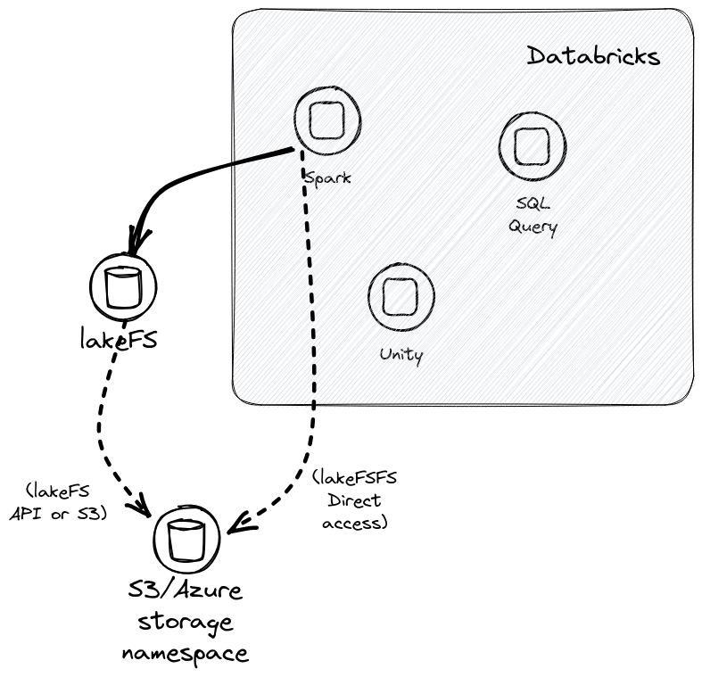
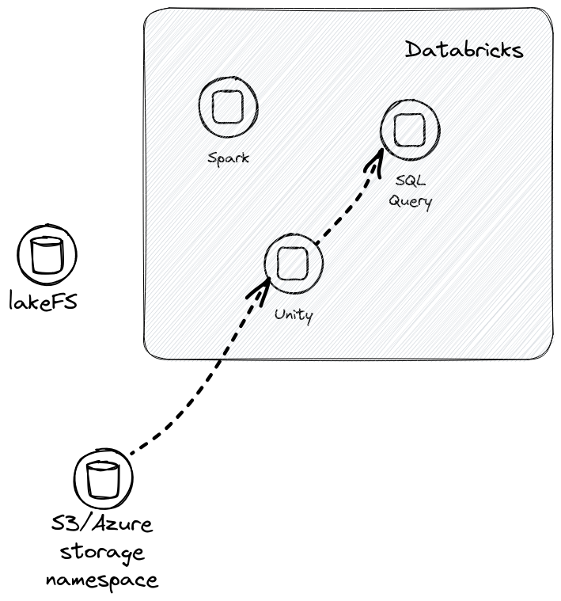

# Epsilon TLD: Export Delta Lake Files from lakeFS to Unity

## Problem and scope

**Note:** Wherever this document refers to the "provider blockstore", this
is the blockstore used by the lakeFS backend: AWS S3, Azure, or in future
Google Cloud Storage.

Unity is a new platform from DataBricks that allows serverless query and
data governance and lineage.  Currently Unity does not offer a way for full
lakeFS integration:

* It supports _only_ a limited set of FileSystems -- ruling out the use of
  the lakeFS API and/or lakeFSFS.
* It can only use provider blockstore endpoints -- ruling out the use of alternative S3
  interface providers such as the lakeFS S3 gateway (or indeed MinIO).
* It requires AWS STS authentication -- ruling out the use of lakeFS
  authentication, as Unity has no way of proving its identity to lakeFS
  based only on its available provider blockstore identity.

As a first step we can use what is available on DataBricks today to offer
*read-only* access to Delta Lake tables on Unity.

Epsilon will export Delta Lake files.  These may be written to lakeFS using
lakeFSFS; obviously the writers _do **not** use Unity_.  We shall then use
Epsilon to export the Delta Lake metadata objects, making the Delta Lake
file available as a Unity table.  In line with lakeFS, Epsilon exports only
the metadata files of Delta Lake.  The actual data files (Parquets) are used
in-place by the exported table.

## User flow

### Configuration

User-side configuration includes:

* An external catalog defined on Unity.  It is stored on provider blockstore
  (_not_ lakeFS).  We _recommend_ exporting tables for a ref to a schema
  named for that ref.
* Credentials to access to this provider blockstore location by Unity and by
  the Epsilon exporter.  Unity should _also_ be allowed to read the storage
  namespace on provider blockstore.
* [Optional] Hooks to run the Epsilon exporter on merge and commit.  These
  could be post- hooks, but pre- hooks will probably also be usable.

### Writer

The writer writes a Delta Lake file as objects to lakeFS.  It can use
lakeFSFS or the S3 gateway, of course, along with appropriate lakeFS
credentials.  All features of lakeFS can be used to manage versions of the
Delta Lake file.

They then trigger an Epsilon exporter run.  It translates Delta Lake
metadata objects to be available to Unity at a known provider blockstore
path.  Unity is not involved in this path, beyond defining an external table
at a given (known) location in a given catalog.

### Reader

Readers read a Delta Lake file as a Unity external table on a catalog.  We
_recommend_ using a schema named for the exported ref.  This external table
is based on the translation performed by the Epsilon exporter.  lakeFS is
not involved in this path.

## Epsilon exporter flow

The Epsilon exporter is a component external to the lakeFS daemon and also
to Unity.

It _reads_ Delta Lake metadata the lakeFS repository at a given ref and
path.  The Delta Lake repository describes the [Delta Transaction Log
Protocol][deltalake-format] used for this Delta Lake metadata.  Some fields
hold _path references_ to specific Delta Lake data objects.[^1]

The input Delta Lake file is at some location
`lakefs://REPO/REF/input/path/`.  That URI can hold data files (Parquets).
It also holds metadata files under a prefix `_delta_log`.  The output Delta
Lake file will be at some location `s3://BUCKET/output/path/`.  It holds
only metadata, so it holds only objects in prefix
`s3://BUCKET/output/path/_delta_log/`.

Epsilon _transforms_ the metadata of the input file:

* In the first version we shall drop CRC files.  A later version will
  restore these.  (These files are not required by Delta!)
* For every path reference in the metadata, it creates a _translated path
  reference_.  When mapping to a physical path, lakeFS destroys all
  information encoded in its paths.  So _all paths to data files must be
  translated into absolute paths on the storage namespace_, whether absolute
  or relative.  The translated path reference is always an absolute on the
  provider blockstore:
  - An _absolute_ path reference `lakefs://REPO/REF/...`, is translated to
    its matching physical path on the provider blockstore by querying lakeFS.
  - A _relative_ path reference `.../...` is expanded into an absolute path
    reference under the root directory, then that absolute path is
    translated to its matching physical path on the provider blockstore by
    querying lakeFS.
  - Delta Lake "DV files" may have an additional "base-85" path encoding.
    Such a path has its base-85 decoded into a UUID, that UUID is then
    expanded to a relative path, which is finally translated into its
    matching physical path on the provider blockstore by querying lakeFS.
* The `_delta_log/_last_checkpoint` file (if it exists) is translated to
  refer to a translated pathname.
* Each metadata file, including other files that may require no translation,
  is output to `s3://BUCKET/output/path/_delta_log/`; currently it seems
  that we will be able to maintain the last key components.[^2]

[^1]: However there are _no_ documented path-prefix fields.

[^2]: TBD: Are `.s3-optimization-...` (empty!) files safe to transfer?
    Should we transfer them? 

## Integration on lakeFS.Cloud

On lakeFS.Cloud we will be able to integrate Epsilon as hooks that run on
commit and on merge.  We can definitely do so in post-commit and post-merge
hooks.  But it seems possible that we will even be able to provide them as
pre-commit and pre-merge hooks -- TBD which is best.

## Execution plan

### Phase 0: Minimal version / PoC

#### Goal

Provide a minimal working environment.  It will provide users (readers) with
the intended experience, but require toil to update the table for each ref.
For instance, users should be able to see whether storing the ref as the
schema component of table names is in fact convenient.

#### What

We will provide Epsilon as a standalone executable.  It will export a single
ref to an output.  All paths will be explicitly supplied.

#### Time estimate

3 person-weeks.

### Phase 1: Scan for tables, lakeFS.Cloud hook implementation

:warning: **Note:** Everything about this phase may very well change due to
results from phase 0.

#### Goal

Automate running the minimal version on _all_ tables of a repository as a
hook.  It will provide operators (writers) with the intended experience by
eliminating toil.  For instance, operators will be able to experience
monitoring export and maintenance under continuous load.

#### What

* Add a way for Epsilon to run on all (changed?) Delta Lake tables in a
  repository.
* Run Epsilon on all repository commits and merges, preferably "pre-" but
  possibly "post-".

#### Time estimate

2 person-weeks.

### Phase 2: lakeFS admin GUI

:warning: **Note:** Everything about this phase may very well change due to
results from phase 0.

#### Goal

Provide a way for customer administrators to configure Epsilon hooks to run
on lakeFS.Cloud, and to view its run logs and/or status.

#### What

* Add to the Cloud admin GUI.
* Route logs to customer logs (probably isolake logs).

#### Time estimate

2 person-weeks.

### Phase 3: Cleanups

* Transform CRC files (These files are not required by Delta, but are
  generated anyway!)
* Incremental reprocessing

## Current limitations and future plans

* Cannot write directly to Unity.  This is the big issue.  It cannot be
  handled entirely on the side of lakeFS, and **will** require cooperation
  from DataBricks Unity to resolve.
* Writers must use `lakefs://...` URLs to write.  Support writing using the
  S3 gateway to lakeFS.  Requires translating a different URL protocol,
  which might be "`s3a`" or "`s3`".
* OSS users will need to implement hooks.  (Running hooks is surprisingly
  difficult to do in the OSS lakeFS code unless we assume a very particular
  runtime environment.  But particular users may prefer to build their own.)
* Much of this work could be a canary on the road to rewriting Delta Lake
  files as part of a merge.

[Delta Transaction Log Protocol]:  https://github.com/delta-io/delta/blob/master/PROTOCOL.md
